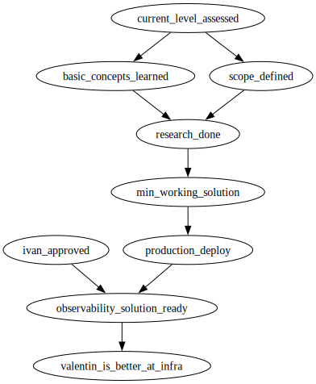

# Overview

This repository documents my exploration of [infrastructure](https://en.wikipedia.org/wiki/IT_infrastructure) in software development.

The main goal is to better understand my current level, identify knowledge gaps, and become more familiar with both conceptual and implementation tools that represent the state of the art in this field.

I've asked my friend [@igarridot](https://github.com/igarridot) for guidance, and he kindly recommended the following:
- Use the "knowledge ladder" framework to assess my current position in infrastructure and backend development.
- Build a solution that enables a small product team to implement [observability](https://en.wikipedia.org/wiki/Observability_(software)) for their product.

## References

- [Site Reliability Engineering: How Google Runs Production Systems](https://sre.google/sre-book/table-of-contents/) by members of the Google's SRE team
- [Extreme Programming Explained: Embrace Change](https://books.google.com.cu/books?id=-DNcBAAAQBAJ) by Kent Beck, Cynthia Andres
- [Knowledge Management: Value Creation Through Organizational Learning](https://link.springer.com/book/10.1007/978-3-319-03698-4) by Klaus North, Gita Kumta

## Roadmap

| goal                         | status   | participants                 | description                                                                                                                                |
|------------------------------|----------|------------------------------|--------------------------------------------------------------------------------------------------------------------------------------------|
| basic_concepts_learned       | pending  | @valentyinboyanov            | @valentyinboyanov has learned the fundamental ideas: monitoring (metrics, logs, traces) and observability (understanding system behavior). |
| current_level_assessed       | pending  | @valentyinboyanov @igarridot | @valentyinboyanov's current level at infra is assessed using the 'knowledge ladder' framework.                                             |
| ivan_approved                | pending  | @igarridot                   | @igarridot has reviewed and confirmed that the solution is suitable for the purpose of this learning exercise.                             |
| min_working_solution         | pending  | @valentyinboyanov            | A minimal working solution using the selected tools can be run locally.                                                                    |
| observability_solution_ready | pending  | @valentyinboyanov            | The observatility solution is ready to be used by a small product team in production environment.                                          |
| production_deploy            | pending  | @valentyinboyanov            | The solution can be deployed on production environment.                                                                                    |
| research_done                | pending  | @valentyinboyanov            | Research on the state of the art in observability is complete.                                                                             |
| scope_defined                | pending  | @valentyinboyanov @igarridot | We have explicitly defined the expected usage, limitations, and what constitutes a 'small' product team.                                   |
| valentin_is_better_at_infra  | pending  | @valentyinboyanov            | @valentinboyanov has a better understanding of his level in infrastructure and is more confident in what he knows and can do.              |
